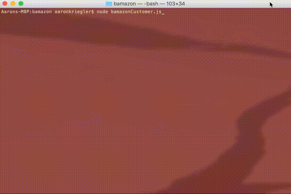
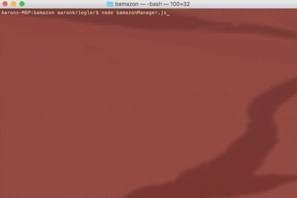
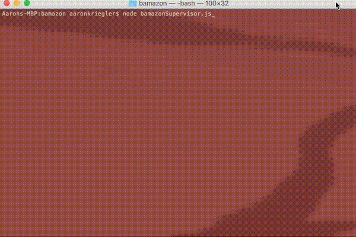

# Bamazon

## Overview

Bamazon is a Node.js and MySQL storefront application that has customer, manager, and supervisor level command line interfaces. Customers can place orders for products from different departments. Managers can monitor, view, create and modify product inventory. Supervisors can create entirely new departments and generate a report of product sales by department.

## Customer View

`node bamazonCustomer.js`

Customers can place orders for products. First, the user is presented with a full list of all products. When prompted, an item ID is to be entered, followed by a quantity for that item. If there is not enough stock, the user will be alerted, otherwise the total cost for the order is displayed.

## Manager View

`node bamazonManager.js`

Managers have several options. The view low inventory option retrieves a list of all products with stock less than 5 so that users can be aware of which products need to be restocked soon. When stock becomes available, the add to inventory option allows the stock to be increased in the database. New products can also be added.

* View Products for Sale
* View Low Inventory
* Add to Inventory
* Add New Product

## Supervisor View

`node bamazonSupervisor.js`

Supervisors can either view product sales by department or add new departments. The sales report displays the total product sales by department and includes total profit which is total sales minus overhead costs.

* View Product Sales by Department
* Create New Department

